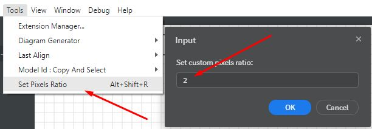
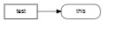

# About

This extensions provides an input dialog box for the user to set manually the parameter `window.devicePixelRatio` which affects the dimensions of the image which is exported in PNG or JPEG or copied via `Ctrl+Shift+C` in the clipboard.

The parameter `window.devicePixelRatio` by default has value of `1.0` or `2.0`, depending the resolution of the monitor. With this extension user can change it on demand to enlarge or scale down the exported bitmaps of diagrams.

After installing, a new command in the Tools menu should be visible, which will pop-up and input window to set your desired pixels ratio.

# Dimensions Example

In the following example we have 3 cases, demonstrating that this *pixels ratio* value **can be used as a scaling factor** too.

## 1. Default value 1.0

The exported to JPEG image has size **266x83 px**.

## 2. Value 0.5

The exported to JPEG image has size **133x41 px**, *half size regarding value 1.0*.

## 3. Value 2.0

The exported to JPEG image has size **532x166 px**, *double size regarding value 1.0*.

